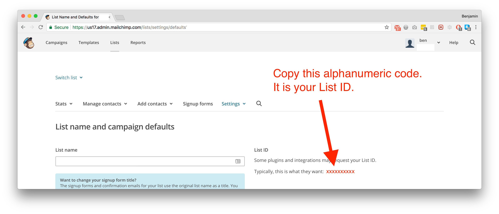
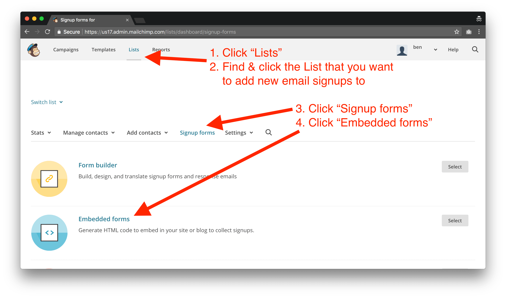
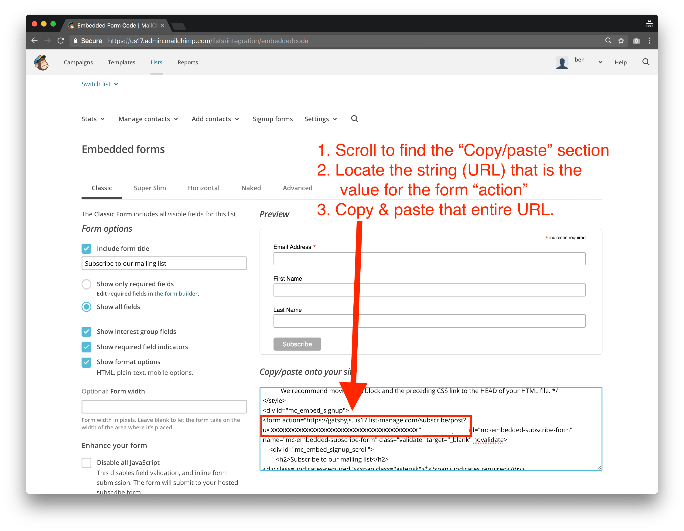

This Gatsby plugin helps you subscribe new email addresses to your Mailchimp list.  Mailchimp does not provide much direction on how to make clientside requests.  After much hacking and research in order to implement this on Gatsbyʼs blog, I built this plugin.

### How It Works
This plugin accepts your Mailchimp account and list settings as well as an email address and any additional user attributes you want to save in MC.  You save your settings in your `gatsby-config.js` file and you send the email and attributes via your React component.

What this plugin does is scan your `gatsby-config` for your MC settings.  Then, once you import and invoke the `addToMailchimp` method in your React component, it makes a jsonp request of the email/attributes to MC's server using your settings.

Because making a request to the Mailchimp server is done asynchronously, this plugin returns a promise, which resolves to whatever is returned from Mailchimp.


### Getting Started
Youʼll first have to add your Mailchimp account and list settings to your `gatsby-config.js` file.  Next, youʼll have to import this plugin into each file youʼd like to use it with.  

This plugin exports one method -- `addToMailchimp` -- that accepts two params: `email` and `listFields`, where `email` is a valid email string and `listFields` is an object of attributes youʼd like to save with the email address.  More detailed instructions below.

In your terminal, type:
`$ yarn add gatsby-plugin-mailchimp`

Then in your `gatsby-config.js` file, add the following code to the plugin section:
```javascript
plugins: [
  ...
  {
    resolve: 'gatsby-plugin-my-cool-plugin',
    // see `Gatsby Config Instructions` section below
    options: {
      listId: '',
      u: '',
      hostname: '',
    },
  },
]
```

Next, navigate to the file where you collect email addresses (ie, the file you want to import this plugin into).  Add the following code:
```javascript
import addToMailchimp from 'gatsby-plugin-mailchimp'

...

export default class MyGatsbyComponent extends React.Component {
  // Since `addToMailchimp` returns a promise, you
  // can handle the response in two different ways:

  // Note that you need to send an email & optionally, listFields
  // these values can be pulled from React state, form fields,
  // or wherever.  (Personally, I recommend storing in state).

  // 1. via `.then`
  _handleSubmit = e => {
    e.preventDefault;
    addToMailchimp(email, listFields)
    .then(data => {
      // I recommend setting data to React state
      // but you can do whatever you want
      console.log(data)
    })
    .catch(() => {
      // unnecessary because Mailchimp only ever
      // returns a 200 status code
      // see below for how to handle errors
    })
  }

  // 2. via `async/await`
  _handleSubmit = async (e) => {
    e.preventDefault;
    const result = await addToMailchimp(email, listFields)
    // I recommend setting result to React state
    // but you can do whatever you want
  }

  render () {
    return (
      <form onSubmit={this._handleSubmit(email, {listFields})}>
        ...
      </form>
    )
  }
}
```

// TODO link to an example of usage.

Things to be aware of:
1. *email address*: pass in the email as normal (ie, _you@gmail.com_); do _not_ encode or transform the email, as our plugin will do that for you!

2. *listFields*: many times you want to collect more than just an email address (first/last name, birthday, page pathname).  I like to store this info in React state and pass it in as list fields.  See below

3. I like to save the returned data to React state so I can then display a success/error message to the user.

#### listFields
Sometimes you want to send to Mailchimp more than just an email address.  Itʼs very common to also send a first name, last name, pathname, etc.  Honestly, you can send whatever you want to store alongside the email address.  Instructions below on how to create new list fields but once youʼve set them up in Mailchimp, you send them alongside the email like this:
```javascript
addToMailchimp('email@example.com`, {
  PATHNAME: '/blog-post-1',
  FNAME: 'Ben',
  LNAME: 'Bordeaux'
  ...
})
```

To setup or modify Mailchimp list fields, navigate to your MC list, click "Settings", then click "List fields".  Then add, remove, or edit fields as you wish:


### Returns
This plugin returns a promise that resolves to the object that is return by Mailchimpʼs API.  The Mailchimp API will always return a status of 200.  In order to know if your submission was success or error, you must read the returned object, which has a `result` and `msg` property:
```javascript
{
  result: string // either `success` or `error` (helpful to use this key to update your state)
  msg: string // a user-friendly message indicating details of your submissions (usually something like "thanks for subscribing!" or "this email has already been added")
}
```

### Gatsby Config Instructions

You need to provide this plugin with your Mailchimp account and list details in order for it to know which endpoint to save the email address to.  Follow these directions:

#### hostname


#### listId


#### u
1. Login to your Mailchimp account
2. Click "Lists" tab at the top
3. Locate the Mailchimp list you want to save email addresses to
4. Click the list
5. Click the subtab "Signup forms
6. Click "Embedded forms"



7. Scroll down to the section with all the HTML code
8. Locate the HTML form element.  Copy the entire URL listed under the form "action" attribute
9. Paste that URL into your `gatsby-config`ʼs `option.endpoint` field



... that's all!

### To do
- ensure MC endpoint is valid
- create basic MC field form (name, email, submit button)
- spec
- test what happens when config is missing values
- test what happens when email is malformed

